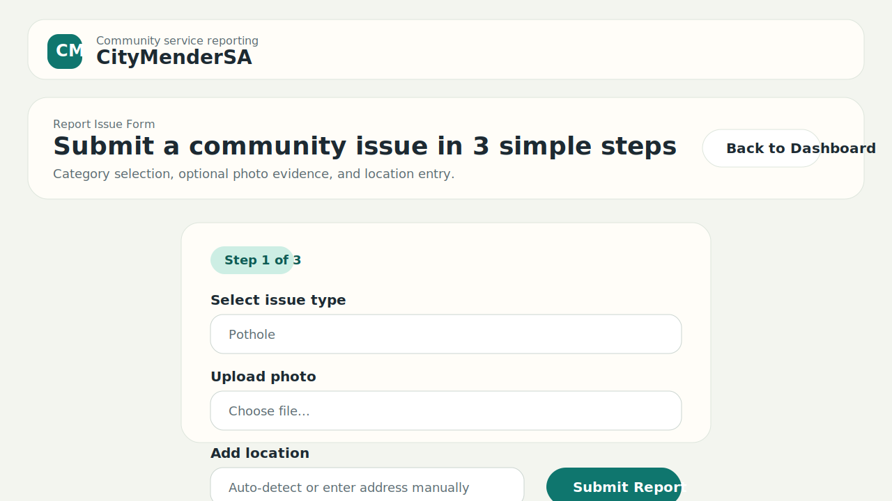
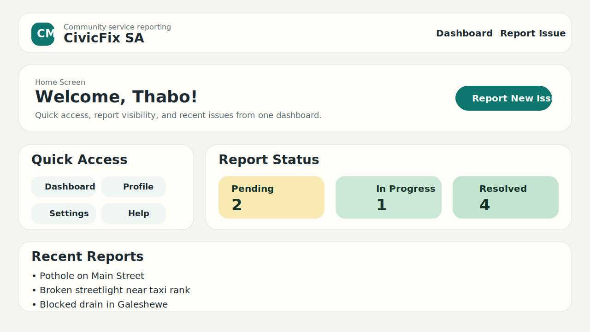
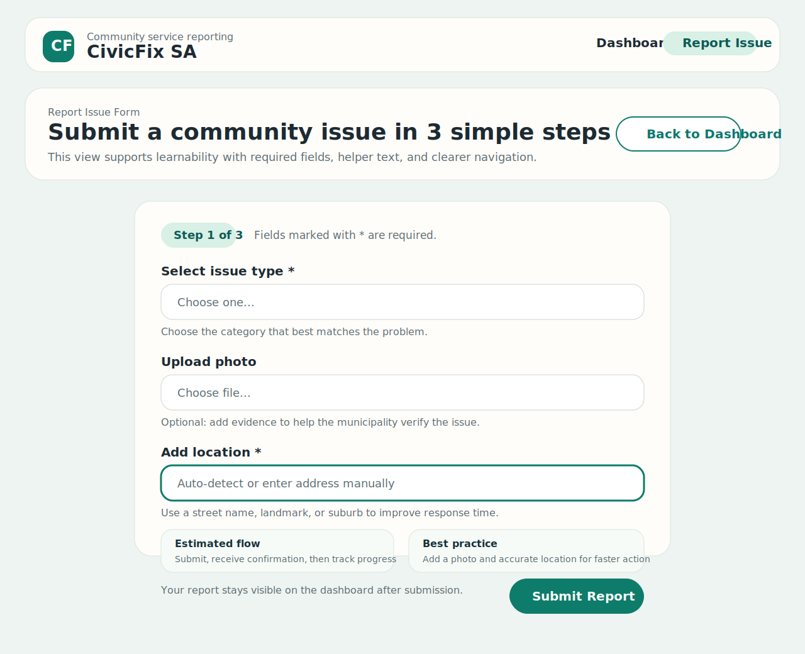
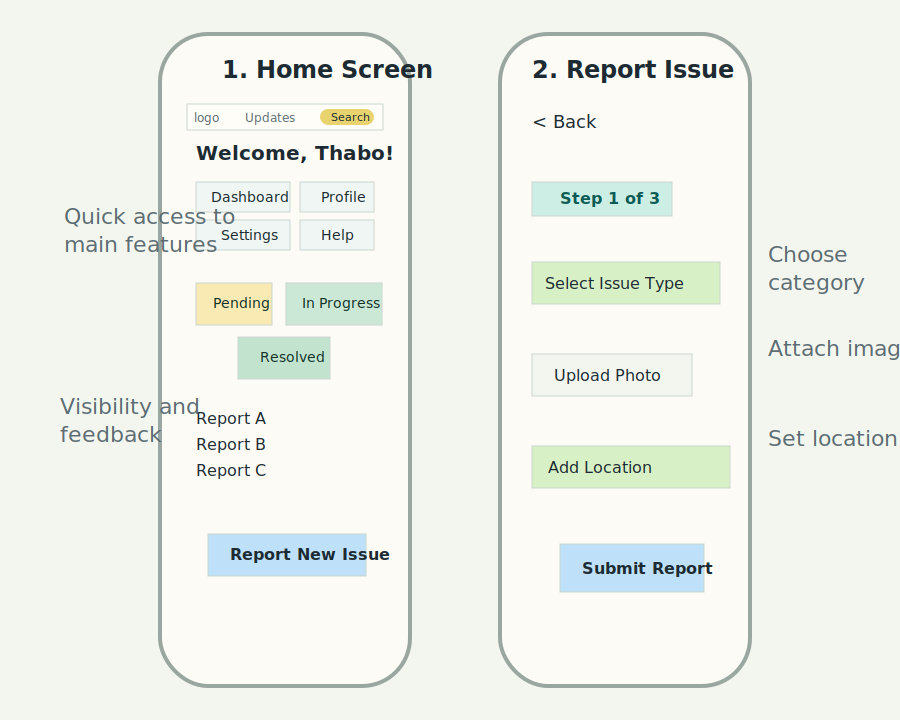

# CivicFix SA Django Wireframe

This repository contains a basic Django wireframe for a community issue-reporting system. It was designed to satisfy the assignment requirement for two apps, two templates, two views, and working URL routing.

## Project Structure

- `citymender/` contains the project settings and root URL configuration.
- `dashboard/` is the first app and serves the home dashboard view.
- `reports/` is the second app and serves the report issue form view.
- `templates/dashboard/home.html` is the dashboard template.
- `templates/reports/report_form.html` is the report submission template.

## Navigation and Layout

The layout uses a shared `base.html` template with a top navigation bar. From the dashboard, the user can move directly to the report form using the `Report New Issue` call-to-action or the navigation menu. The dashboard acts as the main landing page and shows quick-access buttons, report-status cards, and a recent reports list. The report form page keeps the flow simple by showing a back link, a visible progress step, an issue category field, photo upload, and location entry. This supports learnability and visibility of system status, which are both important HCI principles for this municipal reporting scenario.

## URLs

- Home dashboard: `/`
- New report form: `/reports/new/`

## GitHub Link

https://github.com/THOBILE-MTHEMBU/civicfix-sa-django-wireframe
## Screenshots

### 1. Before AI Evaluation

#### Dashboard View

#### Report Form View

### 2. After AI Evaluation

#### Dashboard View

#### Report Form View

### 3. Mobile Flow Overview

